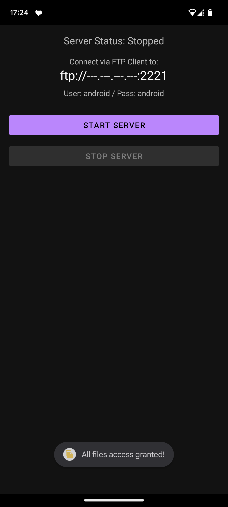
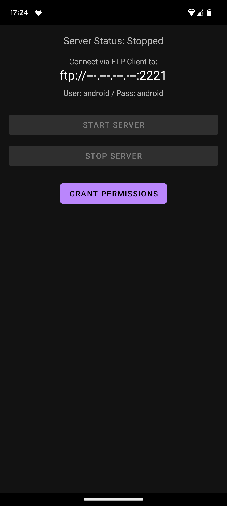
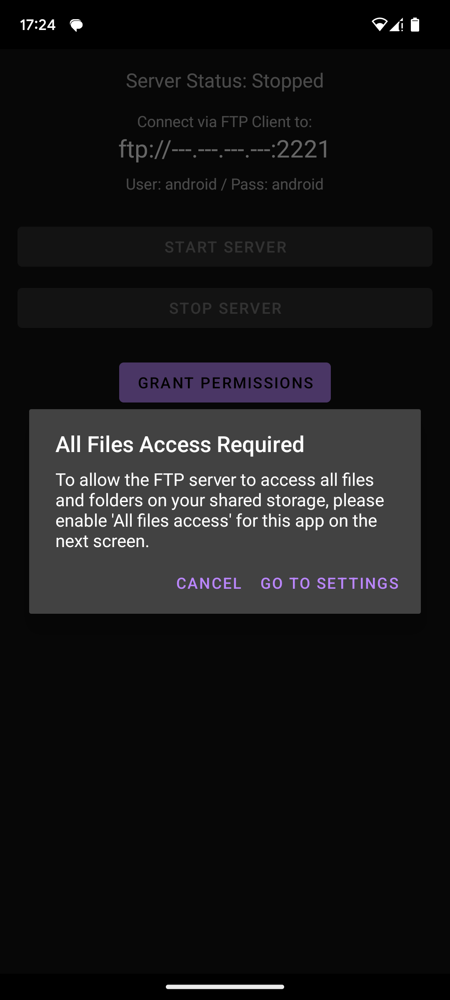
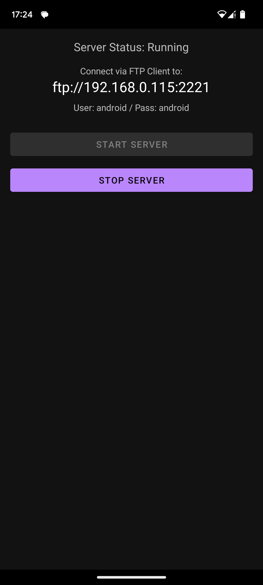
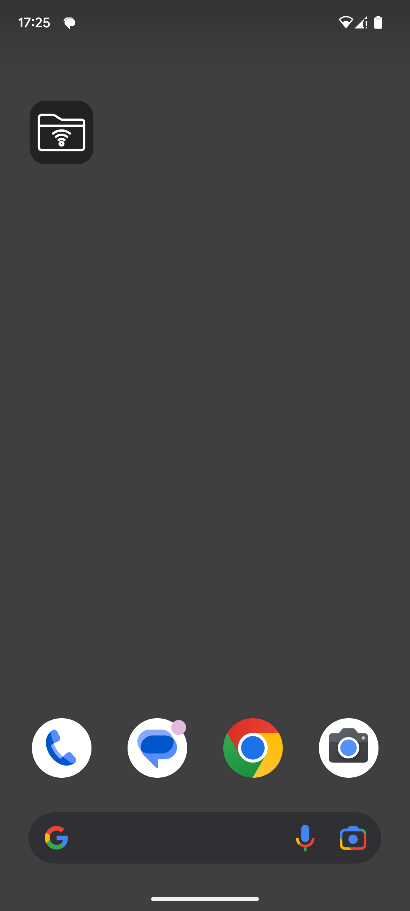
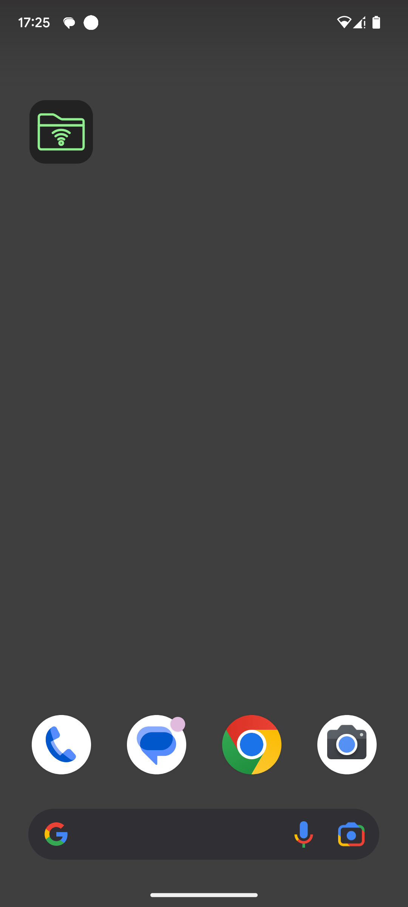

# Simple Android FTP Server

A basic Android application that turns your phone into an FTP server, allowing you to easily transfer files between your phone and PC over your local Wi-Fi network.

  

## Features

* Starts an FTP server listening on port **2221**.
* Uses simple, hardcoded credentials (user: `android`, pass: `android`).
* Shares the root of your phone's primary external storage (Requires "All Files Access").
* Runs as a background (Foreground) service with a status notification.
* Includes a simple **1x1 home screen widget** for quick Start/Stop control.
* Handles necessary permissions ("All Files Access" & "Notifications") on modern Android versions.

## How to Use

1.  **Install:** Build and install the `.apk` on your Android device.
2.  **Connect to Wi-Fi:** Make sure your phone and your computer are connected to the **same Wi-Fi network**.
3.  **Launch App:** Open the "FTP Server App". Initially, the "Start Server" button will likely be disabled.
     
4.  **Grant Permissions:**
    * Tap the **"GRANT PERMISSIONS"** button.
    * Allow **Notification** permission if prompted (Android 13+).
    * You will likely see a dialog explaining the need for **"All Files Access"**. Tap "Go to Settings".
    * In the system settings screen that opens, find the app and **enable the toggle** for "All files access".
    * Navigate back to the app.
     
5.  **Ready to Start:** The "GRANT PERMISSIONS" button should now be hidden, and the "START SERVER" button enabled (as shown in the first screenshot).
6.  **Start Server:** Tap the "START SERVER" button.
7.  **Get Address:** The app will display the server status as "Running" and your phone's IP address (e.g., `ftp://192.168.1.105:2221`).
     
8.  **Connect from PC:**
    * On your computer, open Windows File Explorer, Finder (macOS), or a dedicated FTP client (like FileZilla).
    * Connect to the address shown in the app (e.g., enter `ftp://192.168.1.105:2221` in the File Explorer address bar).
9.  **Login:** When prompted for credentials (Windows might remember them from previous attempts):
    * Username: `android`
    * Password: `android`
10. **Transfer Files:** You should now see the contents of your phone's storage and be able to copy files back and forth.
11. **Stop Server:** Remember to tap "STOP SERVER" in the app or use the widget when you're finished.

## Widget

* You can add the 1x1 widget to your home screen.
* The icon indicates the server status.
* Tap the widget to quickly start or stop the FTP server.

<table>
  <tr>
    <td align="center"> Widget Off</td>
    <td align="center"> Widget On</td>
  </tr>
</table>

## ⚠️ Security Warning

This application uses **hardcoded, insecure credentials** (`android`/`android`) and transmits data unencrypted (standard FTP).

**Only use this application on a private, trusted Wi-Fi network (like your home network).** Do NOT run the server while connected to public Wi-Fi or mobile data if you are concerned about security.

---